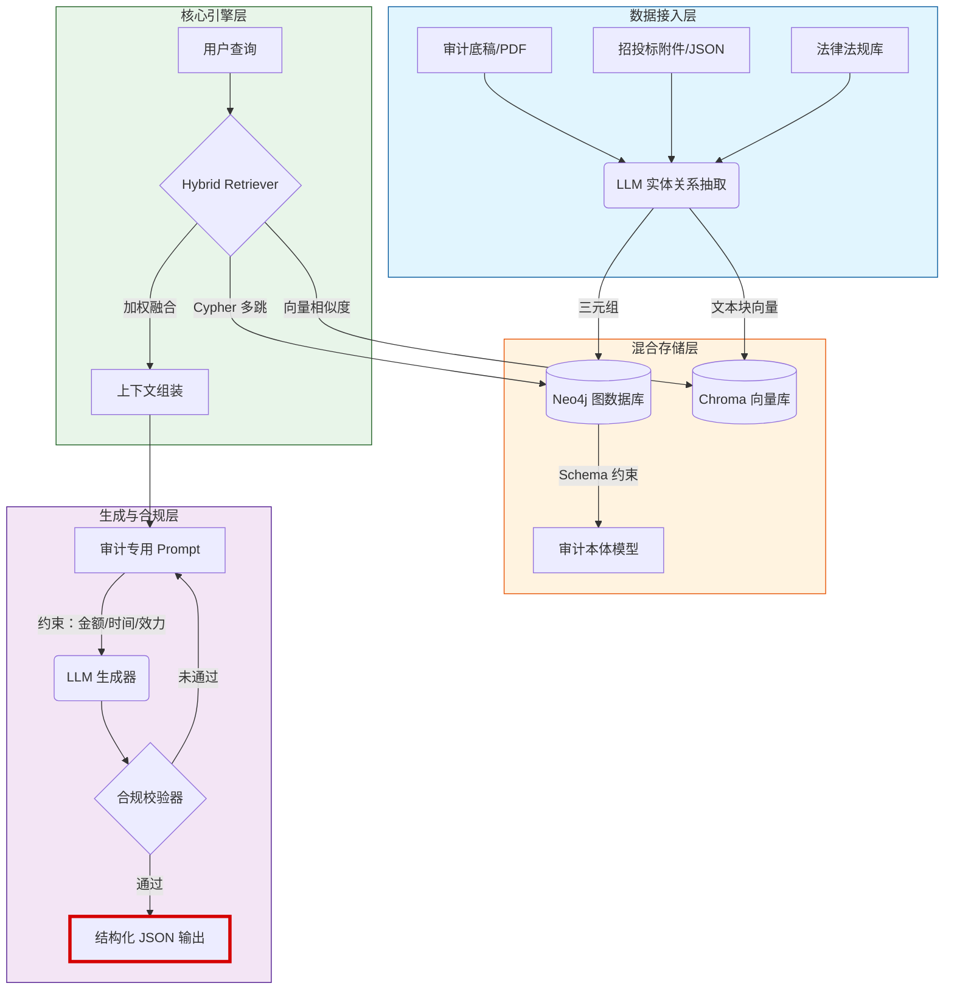

# 📌 项目定位

**graphrag-audit-kb** 是一个面向**审计、财评、招投标**领域的垂直知识图谱增强检索（GraphRAG）系统。

它旨在解决传统 RAG 在审计场景下的三大核心痛点：
1. **法规追溯难**：精准定位条款效力与时效，避免引用废止文件
2. **隐蔽关系挖掘**：通过图谱多跳推理发现"围标串标"、"利益输送"等隐性关联
3. **问答幻觉抑制**：强制模型基于图谱事实生成，提供可验证的溯源路径与置信度评分

---

# 🏗️ 架构数据流



---

# 📁 目录结构与业务映射

| 路径 | 职责说明 | 审计业务映射场景 |
| :--- | :--- | :--- |
| `app/main.py` | FastAPI 入口，定义 `/api/v1/rag/query` 等端点 | 审计作业系统接口对接 |
| `app/config.py` | 环境变量管理 (Neo4j, Chroma, LLM) | 多环境隔离 (开发/生产/涉密网) |
| `app/models/schema.py` | Pydantic 数据模型 (AuditCase, RiskEvent) | 统一审计问题、风险事件的数据标准 |
| `app/models/kg_schema.py` | 图本体定义 (Label, Relation) | 定义"供应商 - 中标 - 项目"等核心关系 |
| `app/core/extractor.py` | LLM 驱动的三元组抽取链 | 从非结构化审计底稿中自动提取线索 |
| `app/core/retriever.py` | **混合检索引擎** (向量 + 图谱) | 支持"查找某公司所有关联方中标记录"的多跳推理 |
| `app/core/generator.py` | RAG 生成器，注入合规约束 | 确保回答包含《审计法》具体条款，禁止模糊表述 |
| `app/services/neo4j_service.py` | 图数据库连接与 Cypher 执行 | 存储复杂的资金流向与股权关系网 |
| `app/services/vector_service.py` | 向量库索引与语义搜索 | 快速检索相似的历史审计案例 |
| `app/utils/prompts.py` | **审计专用 Prompt 模板** | 内置"法规效力优先"、"金额二次校验"逻辑 |
| `data/sample/` | 样例数据 (TXT/JSON) | 预置的模拟招投标违规片段 |
| `tests/` | 端到端测试脚本 | 验证"虚增成本"等典型场景的检出率 |

---

# 🚀 快速开始

## 1. 前置要求

- **Python**: 3.10+
- **Docker & Docker Compose**: 用于启动 Neo4j 和 Chroma
- **LLM API Key**: 兼容 OpenAI 格式的密钥 (如 DeepSeek, Moonshot, Azure OpenAI)

## 2. 完整启动命令链

```bash
# 1. 进入项目目录
cd graphrag-audit-kb

# 2. 配置环境变量
cp .env.example .env
# ⚠️ 请编辑 .env 文件，填入真实的 LLM_API_KEY 和数据库密码

# 3. 启动基础设施 (Neo4j + Chroma)
docker-compose up -d

# 4. 安装 Python 依赖
pip install -r requirements.txt

# 5. 运行集成测试 (验证环境连通性)
pytest tests/test_e2e_pipeline.py -v

# 6. 启动服务
uvicorn app.main:app --host 0.0.0.0 --port 8000 --reload
```

## 3. API 调用示例

**请求**: 查询某工程审计中的虚增成本违规情况

```bash
curl -X POST "http://localhost:8000/api/v1/rag/query" \
  -H "Content-Type: application/json" \
  -d '{
    "query": "某工程审计中发现施工方虚增土方量成本，违反了哪些规定？可能涉及什么风险？",
    "top_k": 3
  }'
```

**标准响应**:

```json
{
  "query": "某工程审计中发现施工方虚增土方量成本，违反了哪些规定？可能涉及什么风险？",
  "answer": "该行为主要违反《中华人民共和国审计法》第三十四条及《建设工程价款结算暂行办法》。涉及风险包括：高估冒领资金风险、合同履约风险。",
  "regulation_basis": [
    {"law": "中华人民共和国审计法", "article": "第三十四条", "content": "..."}
  ],
  "related_cases": ["案例 ID: AUD-2023-005"],
  "confidence_score": 0.92,
  "trace_paths": [
    "Query -> Vector[Chunk_12] -> Neo4j[Risk:CostInflation] -> Law:AuditLaw_Art34"
  ],
  "validation_flags": {
    "amount_checked": true,
    "time_validated": true,
    "law_effective": true
  }
}
```

---

# 🔍 审计特性说明

## 1. 混合检索策略 (Hybrid Retrieval)

系统不单纯依赖语义相似度，而是采用**双路召回 + 加权融合**：

| 检索路径 | 说明 | 适用场景 |
| :--- | :--- | :--- |
| **向量路 (Vector Path)** | 捕捉"虚增成本"、"高估冒领"等语义相似的历史案例描述 | 模糊查询、概念匹配 |
| **图谱路 (Graph Path)** | 通过 Cypher 多跳查询，挖掘"施工方 → 股东 → 监理方"等隐性利益关联 | 关系推理、穿透式审计 |

**融合算法**:
$$Score = \alpha \cdot S_{vector} + \beta \cdot S_{graph}$$

默认 $\alpha=0.4, \beta=0.6$ (图谱权重更高，确保逻辑严密)

## 2. 合规约束机制

在 `app/utils/prompts.py` 中硬编码了审计领域的"铁律"：

| 约束类型 | 说明 | 实现方式 |
| :--- | :--- | :--- |
| **法规效力优先** | 必须检查法规发布与废止时间，禁止引用已废止文件 | Prompt 指令 + 图谱属性过滤 |
| **金额/时间校验** | 涉及具体金额（如"500 万以上"）和时间段时，强制二次逻辑核对 | `validation_flags` 字段强制输出 |
| **强制溯源** | 输出必须包含 `trace_paths`，指明结论来源 | Schema 强制校验，缺失则重新生成 |

## 3. 置信度计算逻辑

最终置信度 ($C_{final}$) 由三部分加权得出：

$$C_{final} = 0.3 \times Match_{vec} + 0.4 \times Strength_{graph} + 0.3 \times Time_{valid}$$

| 因子 | 说明 | 取值范围 |
| :--- | :--- | :--- |
| $Match_{vec}$ | 向量检索相似度 | 0.0 ~ 1.0 |
| $Strength_{graph}$ | 图谱关联路径长度与节点重要性（直接关联 > 间接关联） | 0.0 ~ 1.0 |
| $Time_{valid}$ | 法规时效性系数（现行有效=1.0, 已废止=0.0） | 0.0 或 1.0 |

---

# 🔄 Vibe Coding 迭代指南

本项目设计为"最小可用 + 高扩展"，请使用以下提示词模板引导 AI 助手进行下一步开发：

## 迭代 1: 接入真实 PDF 解析与招投标附件

> "请为 `app/services` 新增 `document_loader.py`，实现基于 `PyPDF2` 和 `pdfplumber` 的 PDF 解析器。要求能识别招投标书中的'表格数据'并将其转换为结构化 JSON，更新 `extractor.py` 以支持从解析后的表格中提取'中标金额'和'工期'实体。"

## 迭代 2: 优化 Cypher 自动生成 (Text2Cypher)

> "当前 `retriever.py` 中的 Cypher 查询是硬编码的。请引入 LangChain 的 `GraphCypherQAChain` 或自定义 Agent，实现根据用户自然语言问题（如'查找 A 公司所有分包商'）动态生成 Cypher 查询语句的功能，并添加语法纠错机制。"

## 迭代 3: 构建专家反馈闭环

> "请在 `app/models/schema.py` 中增加 `Feedback` 模型，并在 `main.py` 添加 `POST /api/v1/feedback` 接口。允许审计专家对 RAG 生成的答案进行'点赞/点踩'并填写修正意见。设计一个后台任务，将高分反馈数据自动写入 Neo4j 作为'黄金案例'节点。"

---

# ❓ 常见问题排查清单

| 问题现象 | 可能原因 | 排查步骤 |
| :--- | :--- | :--- |
| **Neo4j 连接超时** | Docker 容器未启动或端口冲突 | 1. `docker ps` 检查容器状态<br>2. `netstat -an \| grep 7687` 查看端口占用<br>3. 检查 `.env` 中 `NEO4J_URI` 是否为 `bolt://localhost:7687` |
| **检索结果为空** | 向量库无数据或 Embedding 模型不一致 | 1. 运行 `pytest` 确认 `test_mock_data_ingestion` 通过<br>2. 检查 `.env` 中 Embedding 模型名称是否变更<br>3. 确认查询语句与入库文本语言一致 (中/英) |
| **生成内容幻觉** | Temperature 过高或缺乏约束 | 1. 检查 `.env` 中 `LLM_TEMPERATURE` 是否设为 0.0~0.3<br>2. 审查 `prompts.py` 是否包含"禁止编造"指令<br>3. 确认 `retriever` 返回了足够的上下文片段 |
| **金额/时间校验失败** | LLM 未遵循 Schema 输出 | 1. 检查 `generator.py` 中的 Pydantic 输出解析逻辑<br>2. 查看日志中是否有 `OutputParserException`<br>3. 尝试更换更强的 LLM 模型 |
| **Docker 内存不足** | Neo4j Java 进程占用过高 | 1. 修改 `docker-compose.yml` 限制 `MEM_LIMIT`<br>2. 清理 Neo4j 数据卷：`docker volume rm graphrag-audit-kb_neo4j-data` |

---

*最后更新：2024-05-23 | 版本：v1.0.0*
